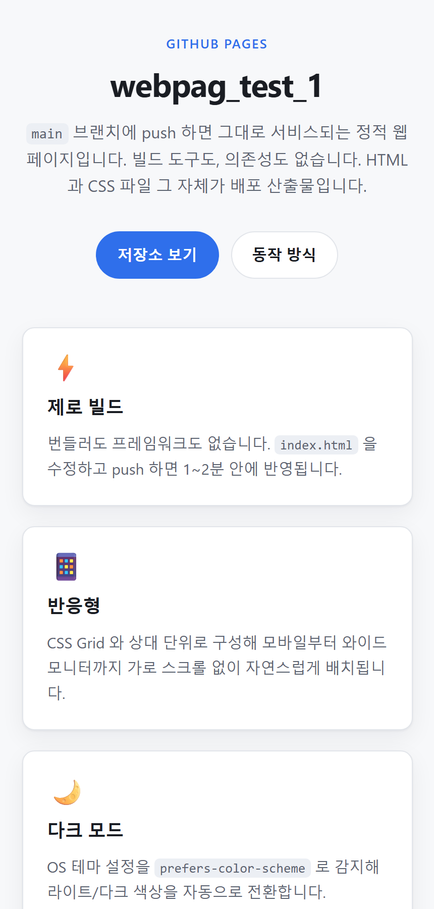
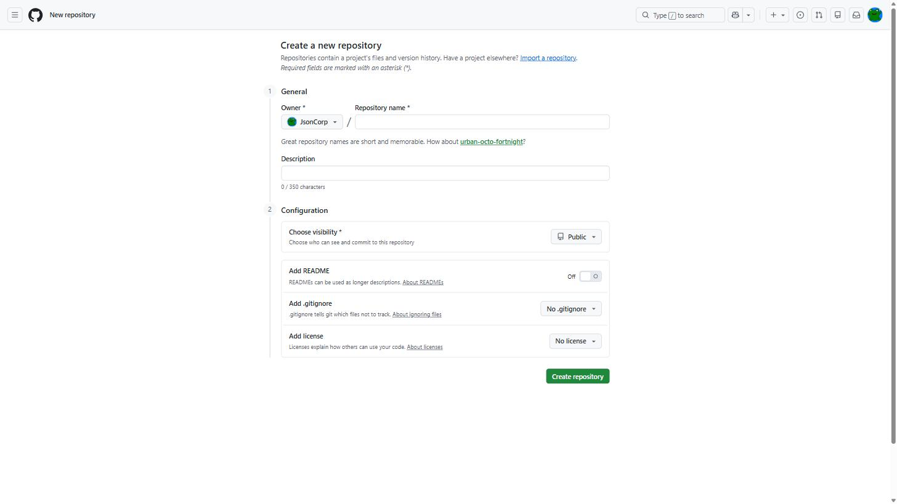
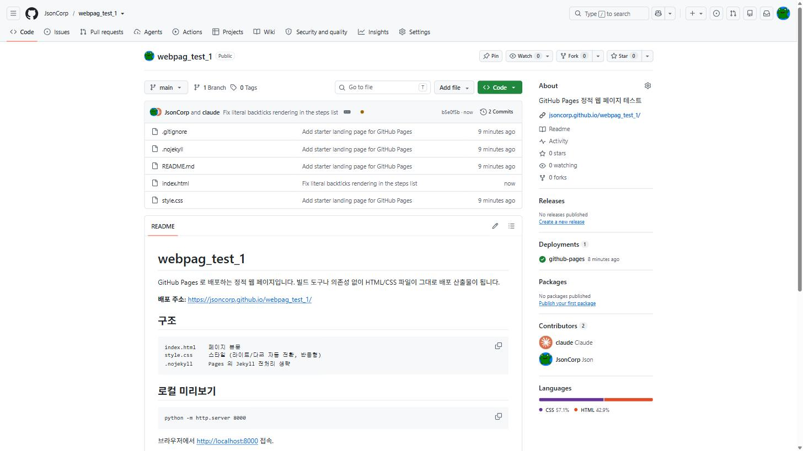
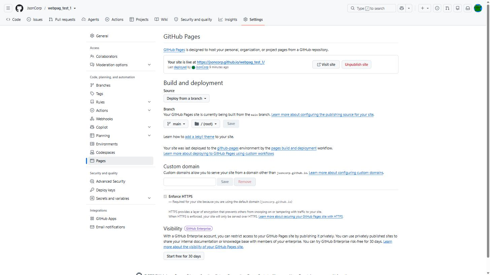
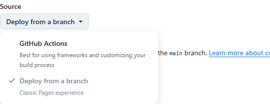
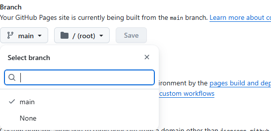
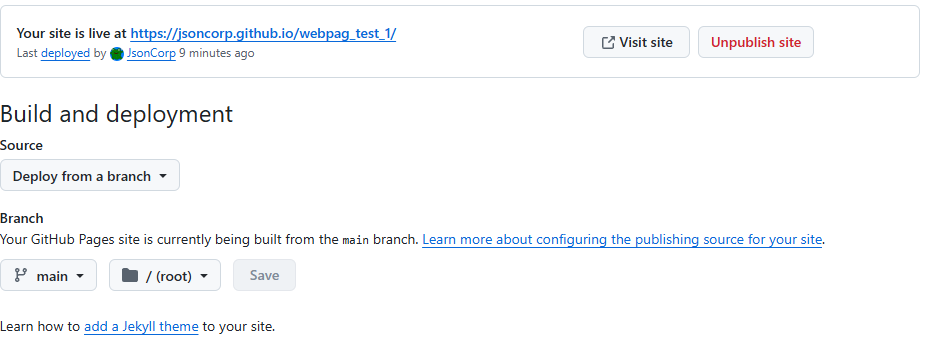
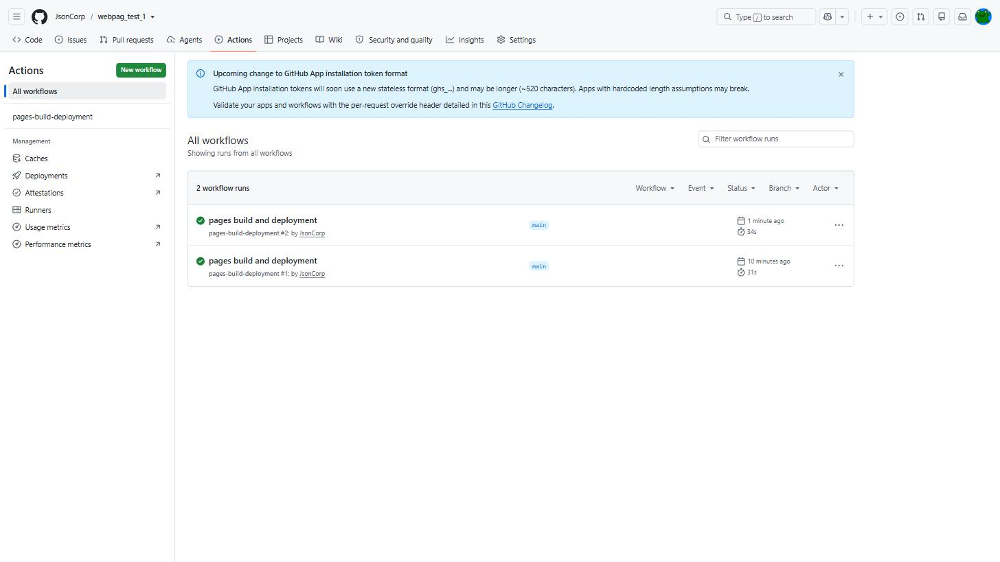

# GitHub Pages로 내 웹페이지 무료 배포하기 (처음부터 끝까지)

서버도, 도메인 구매도, 배포 파이프라인도 없이 웹페이지를 인터넷에 올릴 수 있습니다. GitHub 계정만 있으면 됩니다.

이 글은 실제로 `webpag_test_1` 이라는 저장소를 만들어 **https://jsoncorp.github.io/webpag_test_1/** 로 서비스하기까지의 전 과정을 화면 캡처와 함께 그대로 옮긴 것입니다. 처음 하시는 분이 순서대로 따라오면 10분 안에 자기 페이지가 뜹니다.

---

## 완성된 모습부터

먼저 뭘 만들 건지 봅시다. 프레임워크도 빌드 도구도 없이 HTML 한 장 + CSS 한 장으로 만든 페이지입니다.


OS를 다크 모드로 쓰고 있으면 색상이 자동으로 바뀝니다.


휴대폰에서는 카드가 세로로 쌓입니다. 별도 모바일 페이지를 만든 게 아니라 CSS 한 벌로 처리한 것입니다.



---

## GitHub Pages가 뭔가요

**저장소에 올린 HTML 파일을 GitHub이 그냥 웹사이트로 서빙해 주는 무료 기능**입니다.

| | 일반 웹 호스팅 | GitHub Pages |
|---|---|---|
| 비용 | 월 요금 | 무료 |
| 서버 관리 | 필요 | 없음 |
| 배포 방법 | FTP 업로드 등 | `git push` |
| HTTPS | 별도 설정 | 자동 |
| 한계 | — | **정적 파일만** (PHP·DB 불가) |

마지막 줄이 중요합니다. HTML·CSS·JavaScript는 되지만 서버에서 도는 코드(PHP, 회원가입 DB 등)는 안 됩니다. 소개 페이지, 포트폴리오, 문서 사이트, 프로젝트 데모 용도로 적합합니다.

### 주소는 두 가지 형태

| 종류 | 저장소 이름 | 주소 |
|---|---|---|
| 사용자 페이지 | `아이디.github.io` | `https://아이디.github.io/` |
| **프로젝트 페이지** | 아무 이름 | `https://아이디.github.io/저장소이름/` |

사용자 페이지는 계정당 하나만 만들 수 있습니다. 이 글에서는 여러 개 만들 수 있는 **프로젝트 페이지**로 진행합니다.

---

## 준비물

- GitHub 계정
- Git 설치 (`git --version` 이 나오면 OK)
- 텍스트 에디터 (VS Code 등)

---

## 1단계. 페이지 파일 만들기

빈 폴더를 하나 만들고 그 안에 파일 3개를 만듭니다.

### index.html

**파일 이름은 반드시 `index.html`** 이어야 합니다. GitHub Pages가 주소의 첫 화면으로 찾는 이름이 이것입니다.

```html
<!DOCTYPE html>
<html lang="ko">
<head>
  <meta charset="UTF-8">
  <meta name="viewport" content="width=device-width, initial-scale=1.0">
  <title>webpag_test_1 — GitHub Pages</title>
  <link rel="stylesheet" href="style.css">
</head>
<body>
  <div class="page">
    <header class="hero">
      <p class="eyebrow">GITHUB PAGES</p>
      <h1>webpag_test_1</h1>
      <p class="lead">
        main 브랜치에 push 하면 그대로 서비스되는 정적 웹 페이지입니다.
      </p>
    </header>

    <main>
      <section class="cards">
        <article class="card">
          <div class="card-icon">⚡</div>
          <h2>제로 빌드</h2>
          <p>번들러도 프레임워크도 없습니다.</p>
        </article>
        <!-- 카드는 필요한 만큼 복사해서 늘리면 됩니다 -->
      </section>
    </main>
  </div>
</body>
</html>
```

두 줄만 짚고 갑니다.

- `<meta name="viewport" ...>` — **이 줄이 없으면 모바일에서 화면이 축소되어 보입니다.** 반응형의 출발점입니다.
- `<link rel="stylesheet" href="style.css">` — `href="/style.css"` 처럼 **슬래시로 시작하면 안 됩니다.** 이유는 뒤의 트러블슈팅에서 설명합니다.

### style.css

색상을 CSS 변수로 한 번 정의해 두고, 다크 모드에서는 그 변수 값만 갈아끼우는 방식입니다. 이렇게 하면 다크 모드 대응이 몇 줄로 끝납니다.

```css
/* 라이트 모드 색상 */
:root {
  --bg:         #f7f8fa;
  --bg-elev:    #ffffff;
  --border:     #e2e5ea;
  --text:       #1a1d23;
  --text-muted: #5c6370;
  --accent:     #2f6feb;
}

/* OS가 다크 모드면 값만 교체 — 나머지 CSS는 그대로 */
@media (prefers-color-scheme: dark) {
  :root {
    --bg:         #0d1117;
    --bg-elev:    #161b22;
    --border:     #262c36;
    --text:       #e6edf3;
    --text-muted: #9198a1;
    --accent:     #4f8bf0;
  }
}

* , *::before, *::after { box-sizing: border-box; }

body {
  margin: 0;
  background: var(--bg);
  color: var(--text);
  font-family: -apple-system, "Segoe UI", "Malgun Gothic", sans-serif;
  line-height: 1.65;
}

.page {
  max-width: 68rem;                              /* 너무 넓어지지 않게 */
  margin: 0 auto;                                /* 가운데 정렬 */
  padding: clamp(2rem, 6vw, 4.5rem) clamp(1.25rem, 5vw, 2rem) 3rem;
}

/* 반응형의 핵심 한 줄:
   칸 너비가 15rem 밑으로 내려가면 자동으로 줄바꿈 → 모바일에서 1열 */
.cards {
  display: grid;
  grid-template-columns: repeat(auto-fit, minmax(15rem, 1fr));
  gap: 1.25rem;
}

.card {
  padding: 1.5rem;
  border: 1px solid var(--border);
  border-radius: 12px;
  background: var(--bg-elev);
}
```

미디어 쿼리로 화면 크기별 분기를 일일이 쓰지 않아도, `repeat(auto-fit, minmax(...))` 한 줄이면 데스크톱 3열 → 모바일 1열이 알아서 됩니다.

### .nojekyll

**내용이 비어 있는 파일**을 하나 만듭니다. 이름만 `.nojekyll` 입니다.

GitHub Pages는 기본적으로 Jekyll이라는 블로그 생성기를 한 번 거칩니다. 그 과정에서 `_` 로 시작하는 폴더가 무시되는 등 예상 못 한 일이 생길 수 있는데, 이 파일이 있으면 그 단계를 건너뜁니다. 순수 HTML 사이트라면 넣어 두는 게 안전합니다.

### 로컬에서 미리 확인

파일을 브라우저로 직접 열어도 되지만, 실제 서비스와 같은 환경으로 보려면 폴더에서:

```bash
python -m http.server 8000
```

브라우저에서 `http://localhost:8000` 접속. 여기서 잘 보이면 배포해도 잘 보입니다.

---

## 2단계. GitHub 저장소 만들기

https://github.com/new 로 들어갑니다.



입력할 것은 두 개뿐입니다.

| 항목 | 값 | 설명 |
|---|---|---|
| **Repository name** | `webpag_test_1` | 여기 적은 이름이 **그대로 주소에 들어갑니다** |
| **Choose visibility** | **Public** | ⚠️ 아래 설명 참고 |
| Add README | 꺼둠 | 이미 로컬에 파일이 있으므로 |

> ### ⚠️ 무료 계정은 반드시 Public
> Private 저장소에서 GitHub Pages를 켜려면 유료 플랜(Pro 이상)이 필요합니다.
> 어차피 **Pages로 올린 페이지는 누구나 볼 수 있는 공개 주소**이므로, 개인정보·API 키·비밀번호 같은 건 애초에 올리면 안 됩니다.

`Create repository` 를 누르면 끝입니다.

---

## 3단계. 내 파일 올리기

저장소를 만들면 GitHub이 명령어를 안내해 줍니다. 터미널에서 **아까 만든 폴더로 이동한 뒤** 실행합니다.

```bash
# 이 폴더를 git 저장소로 만들기 (기본 브랜치 이름을 main으로)
git init -b main

# 모든 파일을 담고 첫 기록 남기기
git add -A
git commit -m "Add starter landing page for GitHub Pages"

# 방금 만든 GitHub 저장소와 연결 (아이디/저장소이름은 본인 것으로)
git remote add origin https://github.com/JsonCorp/webpag_test_1.git

# 올리기
git push -u origin main
```

새로고침하면 파일이 올라와 있습니다.



### 참고: gh CLI를 쓰면 2~3단계가 한 줄

[GitHub CLI](https://cli.github.com/)를 설치했다면 웹사이트를 열 필요 없이 저장소 생성·연결·푸시가 한 번에 됩니다. 실제로 이 프로젝트는 이렇게 만들었습니다.

```bash
gh repo create JsonCorp/webpag_test_1 --public --source=. --remote=origin --push
```

---

## 4단계. GitHub Pages 설정하기 ⭐

여기가 이 글의 핵심입니다. 파일을 올렸다고 자동으로 사이트가 되는 게 아니라, **"이 저장소를 웹사이트로 서빙해라"** 라고 한 번 켜 줘야 합니다.

### 메뉴 찾아가기

```
저장소 페이지 → 상단 Settings 탭 → 왼쪽 사이드바 아래쪽 Pages
```

주소로 바로 갈 수도 있습니다: `https://github.com/아이디/저장소이름/settings/pages`

> 💡 Settings 탭이 안 보인다면 본인이 만든 저장소가 아닌 경우입니다. 설정 권한은 소유자에게만 있습니다.



### Source 고르기

`Build and deployment` 아래 **Source** 드롭다운을 엽니다. 선택지가 두 개입니다.



| 선택지 | 언제 쓰나 |
|---|---|
| **Deploy from a branch** | **HTML 파일을 그대로 올릴 때 (← 우리가 고를 것)** |
| GitHub Actions | React·Next.js 등 빌드 과정이 필요할 때 |

지금은 빌드할 게 없으니 **`Deploy from a branch`** 를 고릅니다.

### Branch 고르기

바로 아래 **Branch** 항목에서 드롭다운 두 개를 설정합니다.



| 드롭다운 | 고를 값 | 의미 |
|---|---|---|
| 왼쪽 (브랜치) | **`main`** | main 브랜치의 내용을 서빙 |
| 오른쪽 (폴더) | **`/ (root)`** | 저장소 최상위 폴더가 사이트의 루트 |

> 오른쪽 폴더 선택지에 `/docs` 도 있습니다. 소스 코드와 웹페이지를 한 저장소에서 분리하고 싶을 때 `docs` 폴더 안에 `index.html` 을 두고 이걸 고르면 됩니다. 지금은 `index.html` 이 최상위에 있으니 `/ (root)` 입니다.

마지막으로 **`Save`** 버튼을 누릅니다. **이걸 눌러야 적용됩니다.**

### 1~2분 뒤

페이지를 새로고침하면 상단에 초록 박스로 주소가 뜹니다.



**`Your site is live at https://jsoncorp.github.io/webpag_test_1/`**

이제 이 주소를 누구에게든 보내면 접속됩니다. `Visit site` 버튼으로 바로 열어 볼 수도 있습니다.

### 참고: 명령어로 켜기

CLI를 선호한다면 위 클릭 과정 전체를 이 한 줄로 대체할 수 있습니다.

```bash
gh api -X POST repos/JsonCorp/webpag_test_1/pages \
  -f "source[branch]=main" -f "source[path]=/"
```

---

## 5단계. 배포 확인하기

`Actions` 탭에 들어가면 배포 기록이 남습니다. `pages build and deployment` 항목이 **초록 체크**면 성공입니다.



앞으로는 **파일을 고치고 push 할 때마다 이게 자동으로 한 번씩 돕니다.** 따로 배포 버튼을 누를 필요가 없습니다.

```bash
git add -A
git commit -m "내용 수정"
git push
```

---

## 자주 막히는 지점

실제로 만들면서 겪은 것들입니다.

### 404가 떠요

세 가지를 순서대로 확인하세요.

1. **파일 이름이 `index.html` 이 맞나요?** `Index.html`, `main.html`, `index.htm` 모두 안 됩니다.
2. **아직 빌드 중일 수 있습니다.** 첫 배포는 1~2분, 계정의 첫 Pages라면 더 걸리기도 합니다. Actions 탭에서 초록불을 확인하세요.
3. **주소 끝의 저장소 이름을 빠뜨리지 않았나요?** `jsoncorp.github.io` 가 아니라 `jsoncorp.github.io/webpag_test_1/` 입니다.

### 페이지는 뜨는데 CSS가 안 먹어요 (가장 흔함)

프로젝트 페이지는 사이트가 `/저장소이름/` **하위 경로**에 놓입니다. 그래서 경로 앞에 `/` 를 붙이면 저장소 이름을 건너뛴 엉뚱한 곳을 찾습니다.

```html
<!-- ❌ jsoncorp.github.io/style.css 를 찾아서 404 -->
<link rel="stylesheet" href="/style.css">


<!-- ✅ jsoncorp.github.io/webpag_test_1/style.css -->
<link rel="stylesheet" href="style.css">

```

**규칙: 경로 앞에 `/` 를 붙이지 마세요.** 로컬에서 파일을 직접 열 땐 둘 다 되는 것처럼 보이다가 배포 후에만 깨지기 때문에 놓치기 쉽습니다.

### 수정했는데 옛날 화면이 그대로예요

브라우저 캐시입니다. 실제로 이 글을 쓰면서 오타를 고치고 push 했는데 브라우저에는 계속 옛날 화면이 보였습니다. 서버에는 이미 반영돼 있었고요.

- **Ctrl + Shift + R** (Mac은 Cmd + Shift + R) 로 강력 새로고침
- 그래도 안 되면 시크릿 창에서 확인
- 주소 뒤에 `?v=2` 같은 걸 붙여도 됩니다

### 한글이 깨져요

`<head>` 안에 이 줄이 있는지 확인하세요.

```html
<meta charset="UTF-8">
```

---

## 다음으로 해볼 것

- **페이지 추가** — `about.html` 을 만들고 `<a href="about.html">` 로 연결
- **커스텀 도메인** — 도메인이 있다면 Settings → Pages 의 `Custom domain` 에 입력
- **이미지 넣기** — `images/` 폴더를 만들고 상대경로로 참조
- **접속 통계** — Google Analytics 스크립트를 `</body>` 앞에 삽입

---

## 정리

| 단계 | 할 일 |
|---|---|
| 1 | `index.html`, `style.css`, `.nojekyll` 만들기 |
| 2 | GitHub에서 **Public** 저장소 생성 |
| 3 | `git init -b main` → `add` → `commit` → `push` |
| 4 | **Settings → Pages → Source: `Deploy from a branch` → Branch: `main` `/(root)` → Save** |
| 5 | 1~2분 뒤 `https://아이디.github.io/저장소이름/` 접속 |

정리하면 **파일 3개 만들고, 올리고, 설정에서 스위치 하나 켜는 것**이 전부입니다. 이후로는 `git push` 만 하면 알아서 배포됩니다.

---

**결과물**
- 사이트: https://jsoncorp.github.io/webpag_test_1/
- 소스 코드: https://github.com/JsonCorp/webpag_test_1
